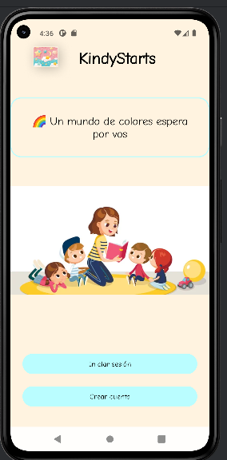
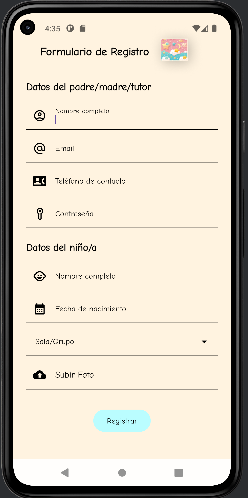
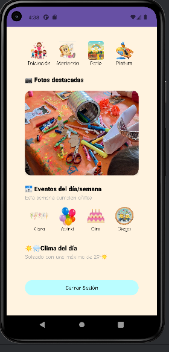

KindyStarts ✨ Aplicación Android para la gestión y registro de tutores y alumnos en una institución infantil.

---

Figma
https://www.figma.com/design/axc8qJWSfJiByNEzdnUCAT/KindyStarts?node-id=0-1&p=f

---

## 📱 Capturas de Pantalla

|                 Main                 | | Login |
|:------------------------------------:| | :---: |
|  | ! [Pantalla de Login](assets/login.png)

| Formulario de Registro | Dashboard Principal |
| :---: | :---: | :---: | 
|  |  |  |

✨ Características Principales
Pantalla de Bienvenida (MainActivity):

Presenta la marca de la aplicación con un logo y nombre.

Base de Datos en Tiempo Real:

La información adicional del usuario (Nombre del niño, Nombre del tutor, Teléfono, Sala) se almacena en la nube.

Un carrusel de texto animado (TextSwitcher) que muestra mensajes de bienvenida dinámicos.

Opciones claras para Iniciar Sesión o Crear una Cuenta Nueva.

Formulario de Registro (RegisterActivity):

Un formulario completo y bien estructurado dividido en dos secciones:

Datos del Padre/Madre/Tutor: Nombre, correo, teléfono y contraseña.

Datos del Niño/a: Nombre, fecha de nacimiento, domicilio y sala/grupo.

Selector de Fecha de Nacimiento: Utiliza un DatePickerDialog para una selección de fecha intuitiva y sin errores.

Campo de Selección de Foto: Un campo personalizado que funciona como un botón para abrir la galería del dispositivo y seleccionar una foto, utilizando las Activity Result APIs modernas.(
 "Se refactoriza la subida de foto, implementando PhotoPickerHelper + interfaz en java" )

Manejo Inteligente del Teclado: La pantalla se ajusta automáticamente (adjustResize) para evitar que el teclado tape los campos de texto al momento de escribir.

Pantalla Principal (HomeActivity):

La pantalla de destino para los usuarios que completan el registro o inician sesión exitosamente.

---

Backend y Base de Datos (Firebase):

Firebase Authentication: Se utiliza para gestionar todo el ciclo de vida de la autenticación (Crear usuario, Iniciar sesión, Obtener usuario actual, Cerrar sesión) usando el proveedor de Email/Contraseña.

Cloud Firestore: Se utiliza como la base de datos NoSQL principal. Cuando un usuario se registra, sus datos adicionales (como childName, parentName, hall, etc.) se guardan en un documento en la colección users, usando el UID de autenticación como identificador único.

---
🛠️ Arquitectura y Tecnologías Utilizadas
Lenguaje: Kotlin.

Arquitectura:

Patrón BaseActivity: Se utiliza una clase base abstracta (BaseActivity) para centralizar y reutilizar código común a todas las Activities, como la configuración del DatePickerDialog y la lógica de la interfaz.

Estructura de Paquetes por Funcionalidad: El código está organizado en paquetes (auth, home, splash, base) para una mejor escalabilidad y mantenimiento.

Interfaz de Usuario (UI):

XML Layouts con componentes de Material Design 3 (TextInputLayout, TextInputEditText, MaterialButton).

Uso de ScrollView con fillViewport para asegurar que los formularios largos funcionen correctamente en todas las pantallas.

Estilos (styles.xml) y recursos centralizados (strings.xml, colors.xml) para una fácil personalización y mantenimiento.

Asincronía:

Kotlin Coroutines (lifecycleScope) para manejar tareas asíncronas en la UI, como el carrusel de texto animado.

APIs de Android:

Activity Result APIs (registerForActivityResult): La forma moderna y segura de manejar resultados de otras Activities, como la selección de imágenes de la galería.

---
